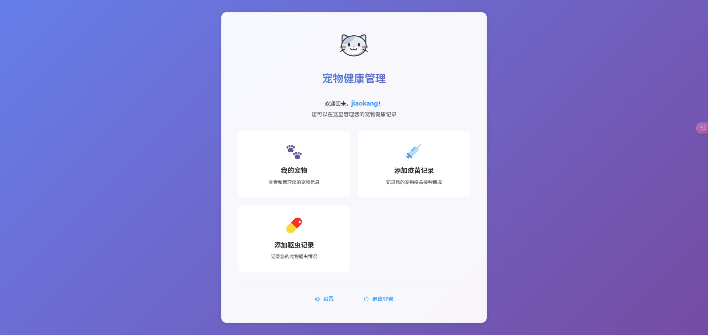
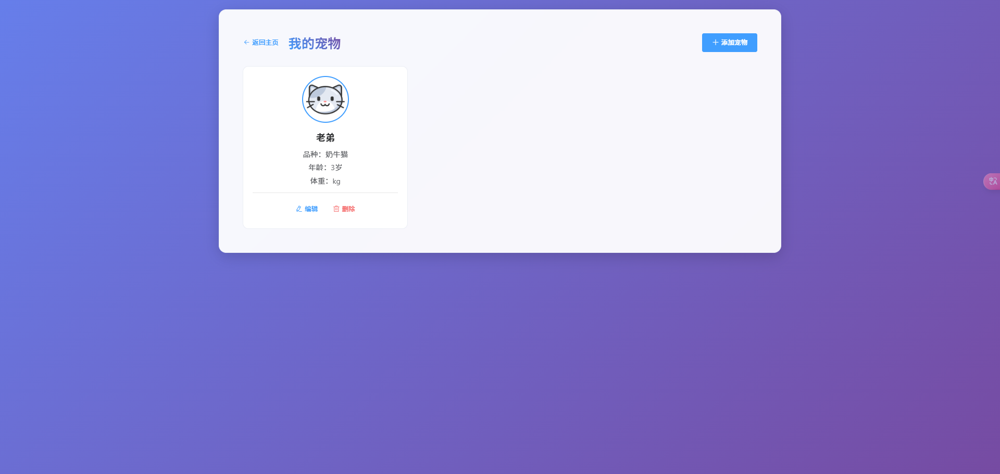
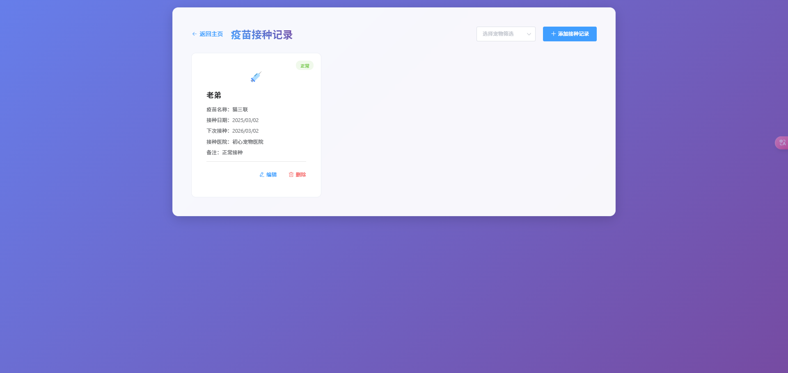

# 🐾 宠物健康管理系统


一个现代化的宠物健康管理系统，帮助主人更好地管理宠物的健康记录。使用 Vue.js 和 Element UI 构建，提供直观的用户界面和流畅的用户体验。

## ✨ 功能特点

### 🏠 主页
- 清晰的功能导航
- 用户信息展示
- 快速访问常用功能

### 🐱 宠物管理
- 添加/编辑/删除宠物信息
- 宠物头像上传
- 基本信息记录（名字、品种、年龄、体重等）

### 💉 疫苗接种管理
- 疫苗接种记录的增删改查
- 按宠物筛选接种记录
- 智能提醒下次接种时间
- 状态标识（正常、即将到期、已过期）

### 💊 驱虫管理
- 驱虫记录的增删改查
- 用药剂量精确记录
- 智能计算下次驱虫时间
- 状态追踪和提醒

## 🎨 界面预览





## 🚀 技术栈

- **前端框架**: Vue.js 2.x
- **UI 组件库**: Element UI
- **状态管理**: Vuex
- **路由管理**: Vue Router
- **HTTP 客户端**: Axios
- **CSS 预处理器**: SCSS
- **构建工具**: Vue CLI

## 📦 安装和运行

1. 克隆项目
```bash
git clone https://github.com/yourusername/pet-health-management.git
cd pet-health-management
```

2. 安装依赖
```bash
npm install
```

3. 运行开发服务器
```bash
npm run serve
```

4. 构建生产版本
```bash
npm run build
```

## 🔧 环境要求

- Node.js >= 12.x
- npm >= 6.x

## 📝 配置说明

在项目根目录创建 `.env` 文件进行环境配置：

```env
VUE_APP_BASE_API=your_api_base_url
VUE_APP_TITLE=宠物健康管理系统
```

## 📚 API 文档

### 宠物管理 API
- `GET /pets` - 获取宠物列表
- `POST /pets` - 添加宠物
- `PUT /pets/:id` - 更新宠物信息
- `DELETE /pets/:id` - 删除宠物

### 疫苗记录 API
- `GET /vaccine-records` - 获取疫苗记录
- `POST /vaccine-records` - 添加疫苗记录
- `PUT /vaccine-records/:id` - 更新疫苗记录
- `DELETE /vaccine-records/:id` - 删除疫苗记录

### 驱虫记录 API
- `GET /deworming-records` - 获取驱虫记录
- `POST /deworming-records` - 添加驱虫记录
- `PUT /deworming-records/:id` - 更新驱虫记录
- `DELETE /deworming-records/:id` - 删除驱虫记录

## 🎯 待办功能

- [ ] 添加体重变化趋势图
- [ ] 实现消息推送提醒
- [ ] 添加宠物社交功能
- [ ] 支持多语言
- [ ] 添加黑暗模式
- [ ] 支持数据导出功能

## 🤝 贡献指南

1. Fork 本仓库
2. 创建特性分支 (`git checkout -b feature/AmazingFeature`)
3. 提交改动 (`git commit -m 'Add some AmazingFeature'`)
4. 推送到分支 (`git push origin feature/AmazingFeature`)
5. 提交 Pull Request

## 📄 开源协议

本项目基于 MIT 协议开源，详见 [LICENSE](LICENSE) 文件。

## 👥 贡献者

- [Your Name](https://github.com/jiaokang) - 项目负责人

## 🙏 鸣谢

- [Vue.js](https://vuejs.org/)
- [Element UI](https://element.eleme.io/)
- [其他相关项目和贡献者]

## 📞 联系方式

- 邮箱：jiaoikang@gmail.com

---

如果这个项目对你有帮助，欢迎 star ⭐️ 支持一下！
